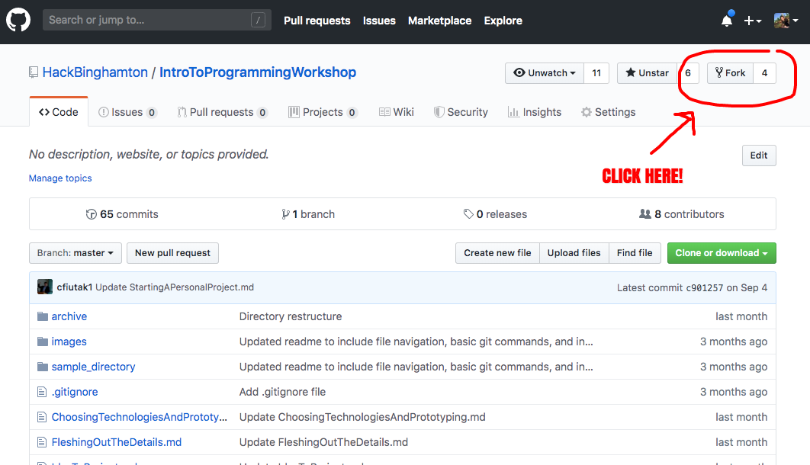

# Overview

* [What is a pull request?](#what-is-a-pull-request)
* [Creating a Pull Request](#creating-a-pull-request)
* [Making Your First Pull Request](#making-your-first-pull-request)

# Making a Pull Request

## What is a pull request?
A **pull request** (PR) tells others about changes that you want to make to a repository. Pull requests are great when you are working on a project with other people because they let each member view your changes, make comments, and review your code before applying your changes to the repository.

Most open source projects on GitHub allow you to directly contribute to their codebase via a pull request, and many tech companies use pull requests as a way to ensure that code is **peer reviewed**.

## Creating a Pull Request
A common flow for a pull request is as follows:

1. Fork the repository
2. Clone the *forked* repository
3. Create a new branch
4. Make your changes
5. Create a pull request to the original repository

### Forking
Forking a repository creates a copy of the current repository under your username. You can fork a repository by hitting the fork button on the upper right hand side of the page:

### Cloning
We'll use the `git clone` command to start editing a local copy of the repository.

Go the page with your newly forked repository and get the link to clone it (from the green *Clone or download* button). 

Now, paste the URL after the `git clone` command. It should look something like this, but with "your-username" replaced by your GitHub username:

`git clone https://github.com/your-username/IntroToProgrammingWorkshop.git`

### Creating a Branch
A branch helps to specify the changes you are making to a code base. The main branch of a project is typically called the **master** branch. It's best practice to only use the master branch for final changes that you want to make live. When creating a new branch, one should give it a descriptive name like `fix-workshop-typo` instead of `my-branch`.

1. To create a branch, make sure you've entered your local copy of your repository:

   `cd IntroToProgrammingWorkshop`

2. Then use the `branch` command to create a new branch:

   `git branch new-branch`

   *Remember to swap `new-branch` with a more descriptive name!*

3. Then to switch to working on that branch, use the `checkout` command:

   `git checkout new-branch`

**Tip**: If you want to combine the last two steps into one command you can use `git checkout -b new-branch`. This command creates *and* switches to the new branch.

If you ever want to switch back to the master branch, use `git checkout master`.

Once you are on your newly created branch, you can add your changes with the typical git flow:

1. `git add file-name`, where `file-name` is the name of the file you want to add
2. `git commit -m "message"`, where the message describes what the committed code does and is a little more descriptive
3. `git push --set-upstream origin new-branch`, where `new-branch` is your branch name
## Making Your First Pull Request
To get started and make your first pull request, check out [this repository on GitHub](https://github.com/firstcontributions/first-contributions)!

Once you get the hang of it, feel free to make pull requests for any of our repositories! Feel free to add an exercise, a personal project, or just fix a typo!

## Sources
* [Creating a Pull Request](https://www.digitalocean.com/community/tutorials/how-to-create-a-pull-request-on-github)
